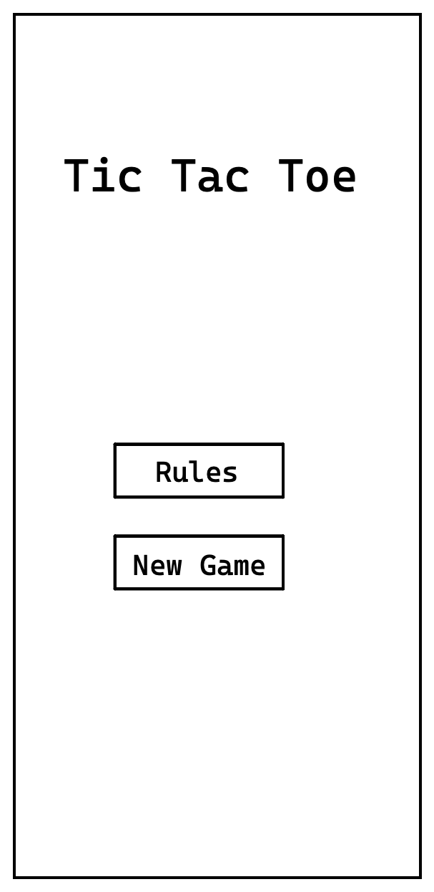
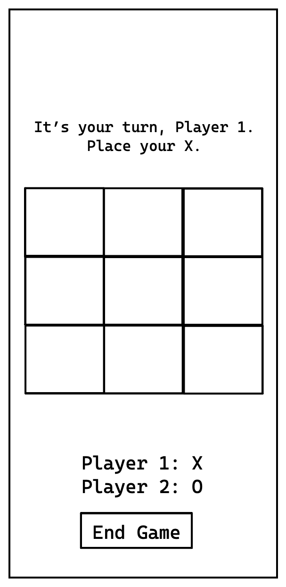
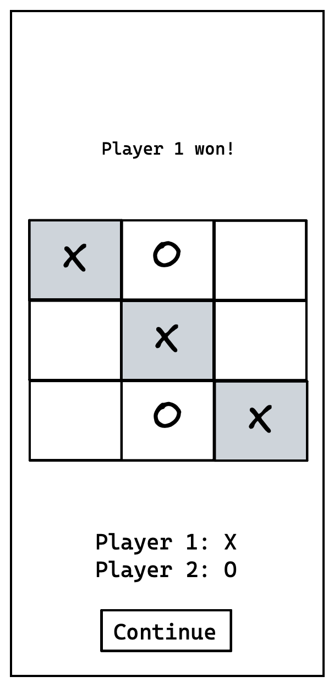
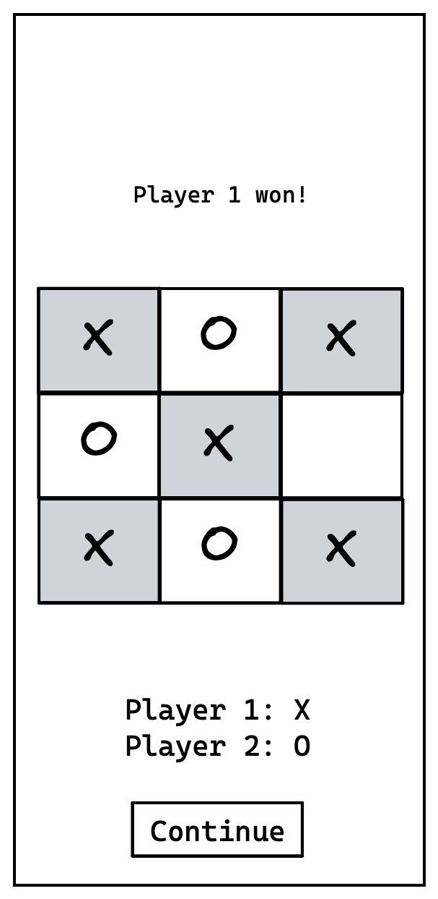
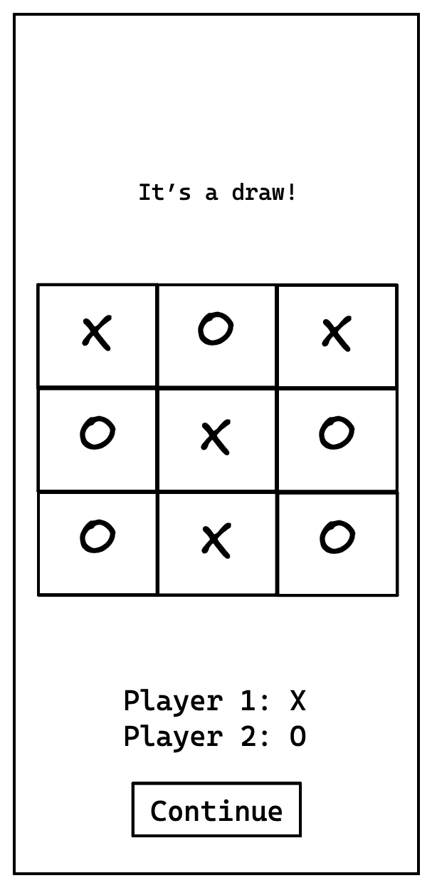

# UX Concept

This UX concept is an implementation of the specification which is defined in `./features`.

## Main Menu

**Displaying:**
- App's title "Tic Tac Toe"

**Actions:**
- "Rules": show the rules of "tic tac toe"
- "New Game": starting a new game. See `"Hot Seat" Game - Start`. 

## "Hot Seat" Game - Start

Example screen showing the start of a "hot seat" game.

**Displaying:**
- label telling who's turn it is
- the board with all placed marks and free cells
- legend telling which mark a player has ("player 1: X")

**Actions:**
- Placing a "X" on a free cell
- "End Game": end the game and return to the main menu

## "Hot Seat" Game - Player 1 won

Example screen showing the "hot seat" game when player 1 won with two diagonals.

**Displaying:**
- label telling who has one
- the board with all placed marks highlighting the "winning cells"
- legend telling which mark a player has ("player 1: X")

**Actions:**
- "Continue": return to the main menu

## "Hot Seat" Game - Player 1 won

Example screen showing the "hot seat" game when player 1 won with two diagonals.

**Displaying:**
- label telling who has one
- the board with all placed marks highlighting the "winning cells"
- legend telling which mark a player has ("player 1: X")

**Actions:**
- "Continue": return to the main menu

## "Hot Seat" Game - Draw

Example screen showing the "hot seat" game when it is a draw.

**Displaying:**
- label telling that it is a draw
- the board with all placed marks highlighting the "winning cells"
- legend telling which mark a player has ("player 1: X")

**Actions:**
- "Continue": return to the main menu
 

